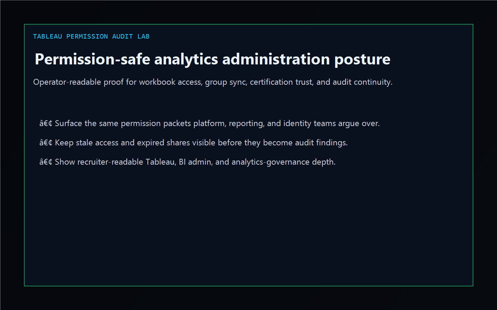
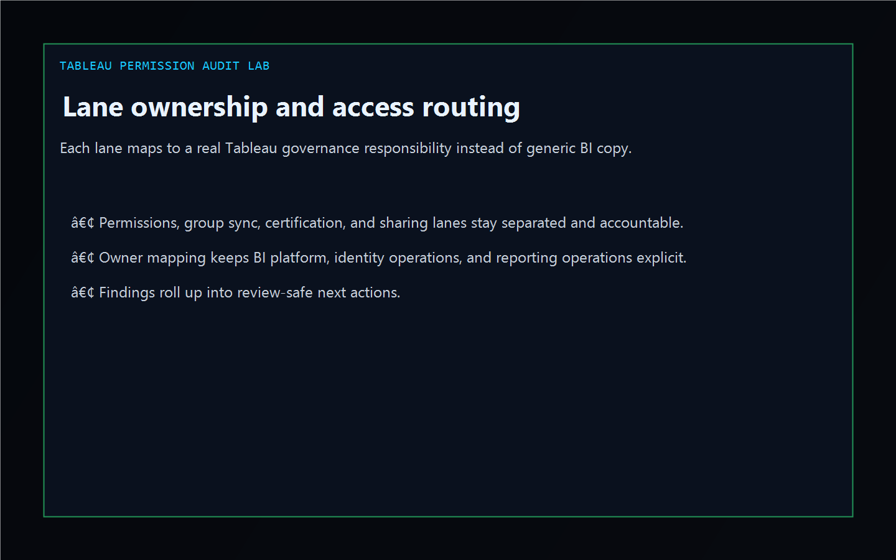
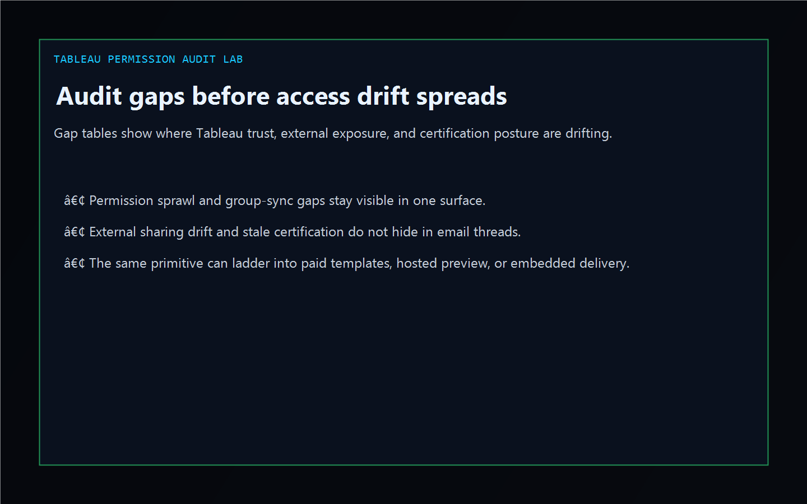
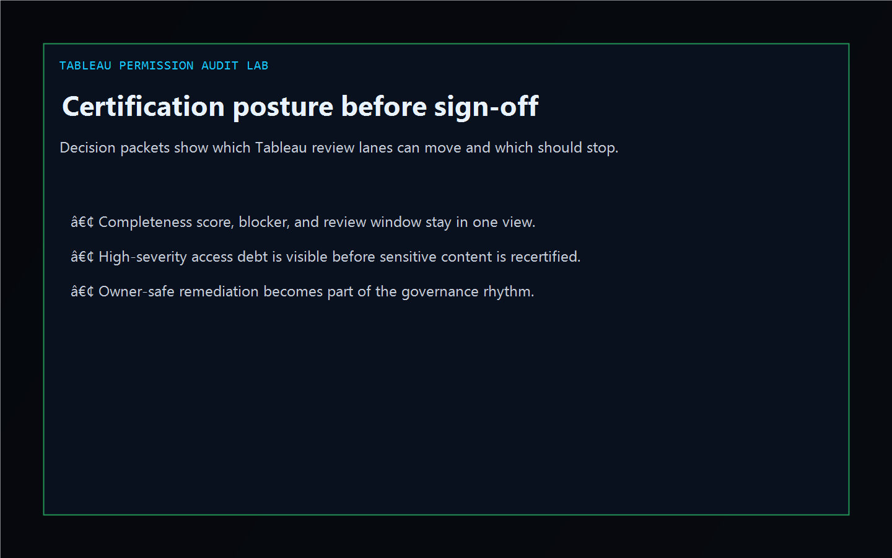

# tableau-permission-audit-lab

[](https://github.com/mizcausevic-dev/tableau-permission-audit-lab/actions/workflows/ci.yml)
[](https://github.com/mizcausevic-dev/tableau-permission-audit-lab/actions/workflows/pages.yml)

Operator control plane for Tableau permission governance, directory-group drift, certification trust, stale external sharing, telemetry gaps, and remediation sequencing.

## Production status

| Aspect | Status |
|--------|--------|
| Deploy | Static prerender -> **https://tableau.kineticgain.com/** |
| Data posture | Synthetic Tableau site, project, workbook, and access-review packets only; no live users, tenant identifiers, or workbook secrets are committed |

## Why this matters

- Tableau breaks at workbook permission overrides, stale group sync, expired partner shares, and stale certification proof long before an audit committee sees the problem.
- Recruiters looking for `Tableau / analytics platform / BI admin / permission governance` proof should see a real operator dashboard, not a keyword page.
- This repo turns Tableau access and certification drift into one control plane for least-privilege containment, group hygiene, audit continuity, and owner-safe remediation.

## Why this matters (KG Embedded tie-back)

This repo demonstrates the permission-audit and certification-control-plane primitive for Kinetic Gain Embedded: Tableau snapshots, certification evidence, sharing risk, and remediation packets in one operator surface. Kinetic Gain Embedded extends this pattern into productized in-app analytics-administration panels where teams need evidence-rich governance without exposing raw admin consoles or live tenant credentials.

## What it shows

- `permission-lane` visibility for permission governance, group sync, certification confidence, and sharing/audit hygiene
- `audit-gaps` detection for permission sprawl, broken group sync, stale certification, external sharing drift, telemetry gaps, and ownership handoff issues
- `certification-posture` packets that tie owner, blocker, timing, and completeness together
- offline-safe analysis of captured Tableau access and activity exports
- recruiter-facing Tableau / analytics governance / BI platform proof that complements the Azure, AWS, reporting, and warehouse lanes

## Routes

- `/`
- `/permission-lane`
- `/audit-gaps`
- `/certification-posture`
- `/verification`
- `/docs`

## API

- `/api/dashboard/summary`
- `/api/permission-lane`
- `/api/audit-gaps`
- `/api/certification-posture`
- `/api/verification`
- `/api/sample`

## Screenshots






## CLI

```powershell
npx tableau-permission-audit-lab fixtures/tableau-permission-hotspots.json `
  --format markdown `
  --fail-on-high
```

## Validation

- `npm run verify`
- `npm run prerender`
- `npm run render:assets`

## Local development

```powershell
cd tableau-permission-audit-lab
npm install
npm run dev
```

Then open:

- [http://127.0.0.1:5524/](http://127.0.0.1:5524/)
- [http://127.0.0.1:5524/permission-lane](http://127.0.0.1:5524/permission-lane)
- [http://127.0.0.1:5524/audit-gaps](http://127.0.0.1:5524/audit-gaps)
- [http://127.0.0.1:5524/certification-posture](http://127.0.0.1:5524/certification-posture)

## Packaging

| Item | Value |
|---|---|
| License | `AGPL-3.0-or-later` |
| CNAME | `tableau.kineticgain.com` |
| Live site | [https://tableau.kineticgain.com/](https://tableau.kineticgain.com/) |
| Deploy | Static prerender -> GitHub Pages |

## Docs

- [docs/KINETIC_GAIN_EMBEDDED.md](./docs/KINETIC_GAIN_EMBEDDED.md)

## Related

- [**`conditional-access-posture-board`**](https://github.com/mizcausevic-dev/conditional-access-posture-board) — identity and access review proof
- [**`powerbi-refresh-reliability-hub`**](https://github.com/mizcausevic-dev/powerbi-refresh-reliability-hub) — reporting delivery and BI platform proof
- [**`vendor`**](https://vendor.kineticgain.com/) — third-party evidence and review posture

## Part of the Kinetic Gain Suite

Operator surface in the [Kinetic Gain Suite](https://suite.kineticgain.com/) — a portfolio of buyer-readable control planes spanning security posture, compliance evidence, data-platform governance, analytics administration, and operator workflows. Apex: [kineticgain.com](https://kineticgain.com/).
